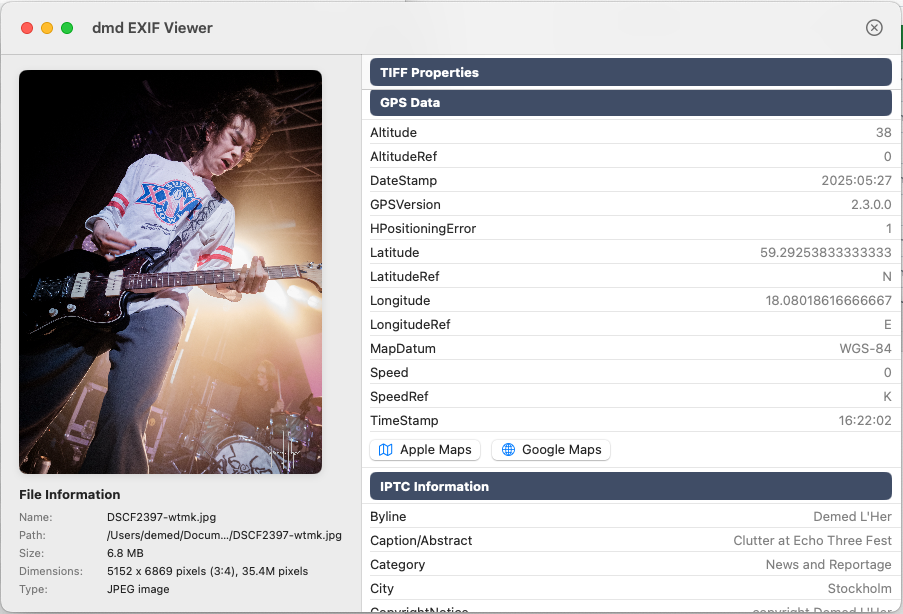

# dmd EXIF Viewer

A native macOS application for viewing EXIF metadata and image properties. Simply drag and drop any image or video file to instantly see all embedded metadata.

## Features

- **Drag-and-drop interface** - Drop any image or video file to view its metadata
- **Comprehensive metadata extraction** - Reads EXIF, TIFF, GPS, IPTC, PNG, and JFIF properties
- **Image preview** - Displays a scaled preview alongside metadata
- **File statistics** - Shows file name, path, size, dimensions, and aspect ratio
- **Smart formatting** - GPS coordinates, lens specs, and complex data types are human-readable
- **"Where was this photo taken?"** - One-click buttons to open GPS coordinates in Apple Maps or Google Maps
- **Native macOS app** - Full dock presence, proper menu handling, SwiftUI interface

## Screenshot



*Split-pane view showing image preview and extracted EXIF metadata with GPS location buttons.*

## Requirements

- macOS 11.0 (Big Sur) or later
- Apple Silicon (arm64) for release builds

## Installation

### Option 1: Download Release

Download the latest `.dmg` from the Releases page, open it, and drag the app to Applications.

### Option 2: Build from Source

```bash
# Clone the repository
git clone https://github.com/demedlher/dmd-EXIF-viewer.git
cd dmd-EXIF-viewer

# Build and run (debug)
swift build
./.build/debug/dmdEXIFviewer

# Or build release DMG
./build.sh
```

## Usage

1. Launch the application
2. Drag and drop an image or video file onto the window
3. View extracted metadata in organized sections:
   - **Image Properties** - Dimensions, DPI, color model, bit depth
   - **EXIF Details** - Camera settings, exposure, ISO, date taken
   - **TIFF Properties** - Make, model, software
   - **GPS Data** - Latitude, longitude, altitude (with buttons to view location in Apple Maps or Google Maps)
   - **IPTC Information** - Copyright, captions, keywords
   - **PNG/JFIF Properties** - Format-specific metadata

## Supported Formats

Any image format supported by macOS ImageIO, including:
- JPEG, PNG, HEIC, TIFF, GIF, BMP, WebP
- RAW formats (CR2, NEF, ARW, etc.)
- Video files (metadata only)

## Project Structure

```
dmd-EXIF-viewer/
├── Package.swift              # Swift Package Manager manifest
├── build.sh                   # Release build script (creates DMG)
├── Sources/
│   └── dmdEXIFviewer/
│       ├── dmdEXIFviewerApp.swift  # App entry point and delegate
│       └── ContentView.swift       # Main UI and metadata logic
├── Resources/
│   └── Assets.xcassets/       # App icons and assets
└── dmg_build/                 # DMG packaging template
```

## Technical Details

- **Language**: Swift 5.9
- **UI Framework**: SwiftUI with AppKit integration
- **Build System**: Swift Package Manager
- **Metadata API**: Apple ImageIO (`CGImageSource`)
- **Dependencies**: None (uses only Apple frameworks)

## License

MIT License - See LICENSE file for details.

## Author

Demed
